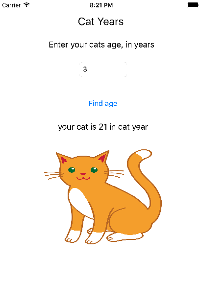

#instructions



```
git clone git@github.com:jrose111284/cat-years-in-swift.git
```

open in xcode and to run application

```
cmd + r
```

###Cat years in swift

This was just a liitle app i made to play with swift.

###What this app does!

This app converts human years into cat years and displays the result.

if you give it the age 3 in human years it will convert it to 21 in cat years

if you enter no value it will tell you to enter a number
